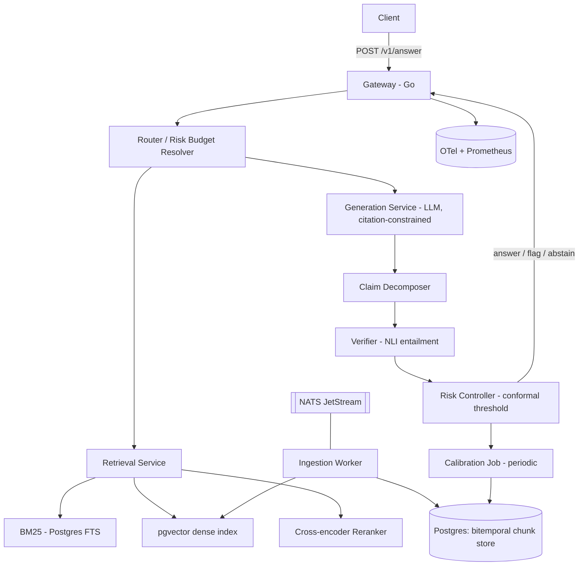

# PRD — Aletheia: Risk-Controlled RAG Gateway

> **Tek cümle:** LLM cevaplarındaki desteksiz iddia (hallucination) oranına *istatistiksel üst sınır garantisi* veren, cümle seviyesinde kanıt doğrulaması yapan ve garantiyi sağlayamadığında bilinçli olarak çekimser kalan (abstain) bir production RAG gateway'i.

| Alan | Değer |
|---|---|
| Doküman sahibi | Ceyda Akın |
| Versiyon | v0.1 (draft) |
| Durum | Proposed |
| Hedef süre | 12 hafta (haftada ~12–15 saat) |
| Ana çıktılar | Açık kaynak repo + canlı demo + teknik rapor/workshop paper + TR-EN eval seti |

---

## 1. Problem

RAG sistemlerinin bugünkü hâli iki uçta:

1. **Demo tarafı:** "retrieve → prompt'a doldur → üret". Cevap akıcı, kaynak listesi altta, ama cevabın *hangi cümlesinin* hangi kaynakla desteklendiği belirsiz. Kullanıcı doğrulamayı kendisi yapmak zorunda.
2. **Kurumsal taraf:** Hukuk, finans, sağlık, regülasyon gibi alanlarda tek bir uydurma cümlenin maliyeti yüksek. Bu yüzden bu kurumlar LLM'i ya hiç kullanmıyor ya da her çıktıya insan onayı koyuyor — bu da otomasyonun değerini sıfırlıyor.

Aradaki boşluk şu: **"Bu sistem ne kadar hata yapar?" sorusuna sayısal ve garantili bir cevap veren bir katman yok.** Mevcut guardrail/eval araçları (RAGAS, TruLens, Guardrails vb.) *ölçüm* yapıyor; ancak çalışma zamanında "bu cevabı vermek risk bütçemi aşıyor mu?" kararını istatistiksel garantiyle veren bir bileşen sunmuyorlar.

**Aletheia'nın tezi:** Doğru soyutlama "daha iyi prompt" değil, **çıktı üzerinde risk kontrolü**. Conformal prediction / distribution-free risk control literatürü tam olarak bunu sağlar: bir kalibrasyon kümesi üzerinde eşik seçerek, yeni gelen sorgularda hata oranına yüksek olasılıkla üst sınır konabilir. Bu makinenin bir RAG servis katmanına gömülmüş, ölçülebilir ve çalışır hâli yok.

### 1.1 Neden bu proje "outstanding" sinyali verir

- **Teorik omurga var:** Sonuç "güzel çalışıyor" değil, "α = 0.05 için desteksiz iddia oranı ≤ %5, %95 güvenle" biçiminde ifade edilebilir bir garanti. Başvuru dosyasında bu, "bir RAG chatbot yazdım"dan kategori olarak farklı okunur.
- **Production omurgası var:** Gateway, SLO, çok kiracılı (multi-tenant) yapı, gözlemlenebilirlik, maliyet bütçesi, k3s üzerinde gerçek deployment.
- **Özgün bir araştırma boşluğu var:** Kalibrasyonun *diller arası* transferi. İngilizce kalibre edilmiş bir eşik Türkçede aynı garantiyi veriyor mu? (Hipotez: hayır — morfoloji, tokenizasyon ve NLI modeli kalitesi kaymaya yol açar.) Bu, ölçülebilir ve yayınlanabilir bir katkı.
- **Kopyalanması zor:** Tek bir notebook'la üretilemez; veri, altyapı ve değerlendirme disiplini ister.

---

## 2. Hedefler ve başarı kriterleri

| # | Hedef | Ölçüt | Hedef değer |
|---|---|---|---|
| G1 | Desteksiz iddia oranını garantiye bağlamak | Test kümesinde ampirik unsupported-claim rate ≤ seçilen α | 10 farklı α için ihlal yok |
| G2 | Garantiyi kullanışlı bir kapsama ile vermek | Answer rate (abstain etmeden cevaplanan soru oranı) @ α=0.05 | ≥ %70 |
| G3 | Production'da kullanılabilir gecikme | p95 uçtan uca latency (streaming, ilk token hariç toplam) | ≤ 3.5 sn |
| G4 | Baseline'a karşı üstünlük | Naive RAG ve "sadece self-consistency" baseline'larına göre aynı answer rate'te daha düşük hata | Δ ≥ 8 puan |
| G5 | Diller arası kalibrasyon bulgusu | EN'de kalibre edilen eşiğin TR'deki ampirik hata oranı | Ölçülmüş ve raporlanmış, düzeltme yöntemi önerilmiş |
| G6 | Tekrar üretilebilirlik | `docker compose up` ile tam sistem + tek komutla eval | Temiz makinede çalışır |

### 2.1 Non-goals (v1'de kapsam dışı)

- Kendi embedding veya LLM modelini eğitmek (fine-tune sadece verifier için opsiyonel).
- Genel amaçlı agent framework olmak. Aletheia bir **serving katmanı**, bir orkestrasyon kütüphanesi değil.
- Multi-hop reasoning'i çözmek. Desteklenir ama iddia edilen katkı bu değil.
- UI/ürünleştirme. Demo arayüzü minimal kalır; asıl yüzey API.
- Gerçek zamanlı web araması. Kurum içi korpus varsayımı.

---

## 3. Kullanıcılar ve senaryolar

**P0 — Regüle sektörde iç bilgi asistanı (birincil persona).**
Bir sigorta/banka operasyon ekibi, poliçe ve mevzuat dokümanları üzerinde soru soruyor. Yanlış cevabın maliyeti yüksek; "bilmiyorum, şu uzmana yönlendir" kabul edilebilir bir çıktı.
*Kabul kriteri:* Cevaptaki her cümle ya bir kaynak parçasına bağlıdır ya da açıkça "desteklenmedi" işaretlidir.

**P1 — Geliştirici / platform ekibi.**
Mevcut RAG'inin önüne bir risk kapısı koymak istiyor. OpenAI-uyumlu bir endpoint'e proxy olarak takar, `risk_budget` parametresi geçer.

**P2 — Araştırmacı / değerlendirme kullanıcısı.**
Kendi korpusunu yükler, sistemin ürettiği kalibrasyon eğrisini ve risk-kapsama (risk–coverage) grafiğini alır.

---

## 4. Ürün gereksinimleri

### 4.1 Fonksiyonel

- **F1 — Sürümlü ingestion.** PDF/HTML/Markdown/DOCX alınır, layout-aware parse edilir, chunk'lanır. Her chunk `(doc_id, version, valid_from, valid_to, span)` ile saklanır. Doküman güncellenince eski sürüm silinmez; bitemporal olarak işaretlenir.
- **F2 — Hibrit geri getirme.** BM25 (Türkçe için morfoloji-duyarlı analyzer) + dense (multilingual embedding) + cross-encoder reranker. Füzyon: Reciprocal Rank Fusion.
- **F3 — Zorunlu atıflı üretim.** Model, her cümlenin sonuna kullandığı chunk id'lerini yazacak biçimde kısıtlanır (structured output / grammar constrained decoding).
- **F4 — İddia ayrıştırma.** Üretilen cevap atomik iddialara bölünür (cümle bazlı + bağlaç kırma).
- **F5 — Kanıt doğrulama.** Her iddia, atıf verdiği chunk'lara karşı bir NLI/entailment modeliyle skorlanır → `support_score ∈ [0,1]`. Atıf yoksa veya entailment düşükse iddia "desteksiz" sayılır.
- **F6 — Risk kontrolcüsü.** Kalibrasyon kümesi üzerinde, verilen α için eşik λ seçilir (Learn-then-Test / RCPS tarzı çoklu hipotez testi). Çalışma zamanında cevabın risk skoru λ'yı aşarsa devreye alternatif davranış girer.
- **F7 — Aksiyon politikası.** Üç mod: `answer` | `answer_with_flags` (desteksiz cümleler kırpılır veya işaretlenir) | `abstain` (+ neden kodu + en iyi 3 kaynak + insana yönlendirme).
- **F8 — Streaming.** SSE ile token akışı; ancak doğrulama tamamlanana kadar cevap "provisional" bayrağıyla akar, sonunda final karar event'i gönderilir.
- **F9 — Geri bildirim ve drift izleme.** Her istek trace'lenir; kalibrasyon dağılımından sapma (korpus güncellemesi, sorgu dağılımı kayması) tespit edilince yeniden kalibrasyon tetiklenir.
- **F10 — Çok kiracılılık.** Tenant başına ayrı korpus, ayrı kalibrasyon eşiği, ayrı risk bütçesi.

### 4.2 Fonksiyonel olmayan

| Konu | Gereksinim |
|---|---|
| Latency | p50 ≤ 1.8 sn, p95 ≤ 3.5 sn (verifier dahil) |
| Throughput | Tek Hetzner node'da ≥ 20 eşzamanlı istek |
| Availability | Demo ortamı için %99 (tek bölge kabul) |
| Maliyet | Sorgu başına ≤ $0.01 (LLM + verifier) |
| Gözlemlenebilirlik | OpenTelemetry trace: retrieval → generation → verification → decision |
| Güvenlik | Tenant izolasyonu, prompt injection için doküman içeriğinin `untrusted` kanalda taşınması |
| Determinizm | Eval çalıştırmaları seed'li ve cache'li |

---

## 5. Sistem mimarisi



### 5.1 Bileşen sorumlulukları

| Bileşen | Dil/teknoloji | Sorumluluk |
|---|---|---|
| Gateway | Go | HTTP/SSE, auth, rate limit, tenant çözümleme, timeout & fallback |
| Retrieval | Python (FastAPI) | Hibrit arama, RRF füzyon, reranking |
| Store | PostgreSQL + pgvector | Chunk, sürüm, embedding, kalibrasyon kayıtları |
| Generation | Python | Prompt inşası, kısıtlı decoding, atıf zorlaması |
| Verifier | Python + küçük NLI modeli (ör. mDeBERTa-tabanlı) | İddia-kanıt entailment skoru |
| Risk Controller | Python | Kalibrasyon, λ seçimi, çalışma zamanı karar |
| Ingestion | Python worker + NATS | Parse, chunk, embed, sürümleme |
| Ops | k3s (Hetzner), Grafana, Loki | Deployment ve gözlem |

**Neden Go gateway + Python servisler:** Gateway'in tek işi düşük gecikmeli I/O orkestrasyonu, kısmi başarısızlık yönetimi ve deadline yayılımı — Go bunun için doğru araç. Model tarafı Python ekosisteminde kalır. Bu ayrım aynı zamanda mevcut Go/k3s deneyiminin doğrudan üzerine biner.

### 5.2 Risk kontrol akışı (özet)

1. Kalibrasyon kümesi $\{(q_i, a_i, y_i)\}$: her cevap için "desteksiz iddia var mı?" etiketi (LLM-as-judge + insan doğrulaması karışımı).
2. Sistem her cevap için skaler bir güven istatistiği üretir: örneğin `min_i support_score_i` veya desteksiz iddia oranının tahmini.
3. Bir eşikler ızgarası üzerinde, her λ için "ampirik risk ≤ α" hipotezi test edilir; çoklu test düzeltmesiyle geçerli λ kümesi bulunur, en yüksek kapsama vereni seçilir.
4. Çalışma zamanında güven istatistiği λ'nın altındaysa → `abstain` veya `flag`.
5. Garanti, kalibrasyon ve test dağılımlarının değişebilirliği (exchangeability) varsayımına dayanır → **drift izleme bu yüzden opsiyonel değil, garantinin bir parçası.** PRD'de bu açıkça belgelenir; kaymada garanti geçersizdir ve sistem "degraded" moduna geçer.

---

## 6. API sözleşmesi

```http
POST /v1/answer
Authorization: Bearer <tenant_key>
Content-Type: application/json

{
  "query": "2024 sonrası imzalanan sözleşmelerde fesih ihbar süresi nedir?",
  "risk_budget": 0.05,
  "as_of": "2026-01-01",
  "mode": "strict",          // strict | flagged | permissive
  "stream": true
}
```

```json
{
  "decision": "answer_with_flags",
  "answer": "…",
  "claims": [
    {
      "text": "Fesim ihbar süresi 30 gündür.",
      "citations": ["doc_412:v3:chunk_18"],
      "support_score": 0.94,
      "status": "supported"
    },
    {
      "text": "Bu süre kamu sözleşmelerinde de geçerlidir.",
      "citations": [],
      "support_score": 0.11,
      "status": "unsupported",
      "action": "removed"
    }
  ],
  "risk": {
    "budget": 0.05,
    "statistic": 0.11,
    "threshold": 0.38,
    "guarantee": "P(unsupported_claim) <= 0.05 with 95% confidence, calibration_id=cal_2026_07_tr"
  },
  "retrieval": { "k": 24, "reranked_to": 6, "latency_ms": 310 },
  "trace_id": "01J…"
}
```

`abstain` durumunda `answer` boş döner; `abstain_reason` ∈ {`insufficient_evidence`, `conflicting_sources`, `out_of_corpus`, `stale_calibration`} ve `suggested_sources` doldurulur.

---

## 7. Veri ve değerlendirme planı

### 7.1 Korpuslar

| Korpus | Kaynak | Neden |
|---|---|---|
| EN-Public | Wikipedia alt kümesi + arXiv abstract'ları | Karşılaştırılabilirlik |
| EN-Domain | Kamuya açık SEC 10-K dosyaları | Uzun, tablolu, gerçekçi zorluk |
| TR-Domain | Resmî Gazete / KVKK / mevzuat metinleri (kamuya açık) | Türkçe, terminoloji yoğun, sürümlü |
| TR-Adversarial | Elle üretilmiş 150 tuzak soru | Korpusta cevabı olmayan sorular; abstain'i test eder |

### 7.2 Eval seti

- Korpus başına ~400 soru–cevap–kanıt üçlüsü. Üretim: LLM ile taslak + **elle doğrulama** (bu kısmın kestirmesi yok; kalitesi projenin ciddiyet sinyali).
- Her soru için kategori: `answerable`, `unanswerable`, `time-sensitive`, `multi-doc`, `conflicting`.
- Kalibrasyon / test ayrımı sızıntısız; kalibrasyon seti sadece λ seçiminde kullanılır.

### 7.3 Metrikler

**Geri getirme:** Recall@k, nDCG@10, MRR.
**Üretim:** Citation precision/recall, attributable-claim ratio.
**Risk:** ampirik unsupported-claim rate (α'ya karşı), answer rate, risk–coverage eğrisi ve altındaki alan, kalibrasyon ihlali sayısı.
**Sistem:** p50/p95 latency bileşen kırılımlı, sorgu başı maliyet, cache hit oranı.
**Ablasyon:** (a) reranker'sız, (b) verifier'sız (sadece self-consistency), (c) atıf zorlaması yok, (d) tek dilde kalibrasyon → çapraz dil testi.

### 7.4 Baseline'lar

1. Naive RAG (top-k + tek prompt).
2. RAG + LLM-as-judge post-filtre (eşik elle seçilmiş).
3. Self-consistency (n=5 örnekleme, çoğunluk).
4. Aletheia (tam sistem).

Karşılaştırma **aynı answer rate'te hata oranı** üzerinden yapılır — tek başına "daha az hata" iddiası, daha çok çekimser kalarak elde edilebileceği için anlamsızdır. Bu detay, değerlendirme okuryazarlığının en görünür kanıtı.

---

## 8. Yol haritası (12 hafta)

| Hafta | Kilometre taşı | Çıktı |
|---|---|---|
| 1 | Kapsam kilitleme, korpus toplama, repo iskeleti | README + ADR-001 (mimari kararlar) |
| 2 | Ingestion + bitemporal chunk store | Sürümlü doküman yükleme çalışır |
| 3 | Hibrit retrieval + reranker | Recall@10 baseline ölçüldü |
| 4 | Eval seti v1 (EN) | 400 QA, elle doğrulanmış |
| 5 | Atıflı üretim + claim decomposer | Citation precision ölçülebilir |
| 6 | Verifier entegrasyonu | support_score dağılımı raporlandı |
| 7 | **Risk controller + kalibrasyon** | İlk risk–coverage eğrisi ← *projenin kalbi* |
| 8 | Go gateway, SSE, timeout/fallback | p95 latency ölçüldü |
| 9 | TR korpus + TR eval seti | Çapraz dil kalibrasyon deneyi |
| 10 | k3s deployment, OTel, Grafana panoları | Canlı demo URL'i |
| 11 | Ablasyonlar + tam sonuç tablosu | Sonuçlar dondu |
| 12 | Teknik rapor, demo videosu, blog yazısı | Yayına hazır paket |

**Kritik yol:** Hafta 7. Bir gecikme olursa TR tarafı (Hafta 9) daraltılır, risk kontrolcüsü asla kırpılmaz — projenin ayırt edici tarafı odur.

---

## 9. Riskler

| Risk | Etki | Azaltma |
|---|---|---|
| Türkçe NLI modeli zayıf çıkar | Verifier gürültülü → garanti anlamsızlaşır | Önce 200 örnekle verifier'ın kendisini validate et; gerekirse küçük bir TR NLI fine-tune (LoRA) |
| Eval seti hazırlığı zaman yer | Takvim kayar | Hafta 4'ü sert kapı yap; korpus başına 400 soru hedefini 250'ye indirmeye izin ver |
| Exchangeability varsayımı gerçekçi değil | Garanti abartılı olur | Sınırı açıkça yaz; drift tespiti ve "degraded mode" ürünün parçası olsun. Dürüstlük burada güç göstergesidir |
| Latency bütçesi verifier yüzünden patlar | Ürün iddiası zayıflar | Verifier'ı batch + quantize et; sadece düşük güvenli iddialar için tam doğrulama (cascade) |
| Kapsam şişmesi (agent, UI, çoklu model) | Hiçbiri bitmez | Non-goals listesi PRD'nin bağlayıcı kısmıdır |
| LLM API maliyeti | Bütçe | Eval cache'i disk'te; deterministik seed; ablasyonlarda küçük model |

---

## 10. Çıktı paketi (Definition of Done)

- [ ] Public repo: temiz README, mimari diyagram, `docker compose up` ile ayağa kalkar, tek komutla eval.
- [ ] Canlı demo (kendi korpusunu yükle → risk bütçesi seç → cevabı ve kanıt kırılımını gör).
- [ ] 8–12 sayfalık teknik rapor: yöntem, deneyler, ablasyonlar, sınırlılıklar. Workshop başvurusu için hazır format.
- [ ] Yayımlanmış TR-EN eval seti + kalibrasyon protokolü (bu tek başına atıf alabilecek bir katkı).
- [ ] 3 dakikalık demo videosu.
- [ ] Blog yazısı: "RAG'de doğruluk bir umut değil, bir parametredir."

---

## 11. Açık sorular

1. Güven istatistiği olarak `min support_score` mu, iddia oranı mı, yoksa öğrenilmiş bir skorlayıcı mı? → Hafta 6'da ampirik olarak seçilecek.
2. Çelişen kaynaklar (aynı sorunun iki farklı doküman sürümünde farklı cevabı) `abstain` mi, "her ikisini sun" mu? → `as_of` parametresi varsayılan çözüm, ama tarih verilmezse politika belirsiz.
3. Kalibrasyon tenant başına mı, domain başına mı? Küçük tenant'larda kalibrasyon örneği yetmeyebilir → hiyerarşik/pooled kalibrasyon araştırılacak.
4. Verifier'ın kendi hata payı garantiye nasıl dahil edilir? (Gürültülü etiketlerle risk kontrolü — literatürde aktif bir konu, dürüst bir "limitation" bölümü şart.)

---

## 12. Okuma listesi (temel)

- Angelopoulos & Bates — *A Gentle Introduction to Conformal Prediction and Distribution-Free Uncertainty Quantification*
- Angelopoulos et al. — *Learn then Test* / *Risk-Controlling Prediction Sets*
- Quach et al. — *Conformal Language Modeling*
- Gao et al. — *RARR: Attributed text generation via post-hoc research and revision*
- Bohnet et al. — *Attributed Question Answering* (AIS değerlendirme çerçevesi)
- Es et al. — *RAGAS*
